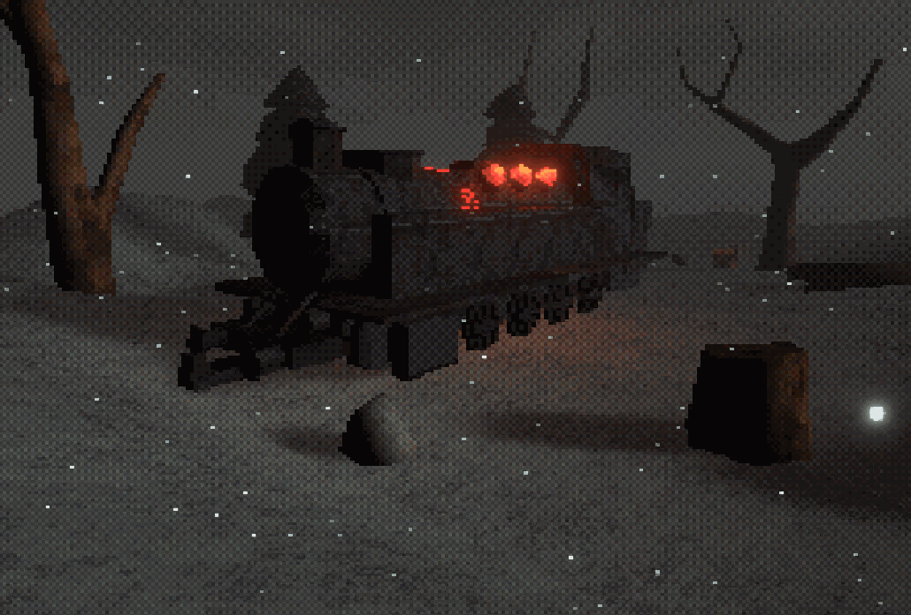

# HPSX-URP Shader Graph Tools
This repo is created to help fill the missing gap for URP supported Post Processing and Shader Graph based PSX rendering tools.

This tool set was made possible by code from the URP PSX repo and the LWRP PS1 shaders repo.

https://github.com/Kodrin/URP-PSX

https://github.com/BroMandarin/unity_lwrp_psx_shader

There are major modifications made to the Dithering (which did not seem right to me in the original URP volume toolset) and the LWRP PS1 shaders were updated to URP.

Some PSX elements can be exagerated using the shader graph. Currently shadergraph is still WIP.

### Current Features
- Basic Dithering + custom scaling
- Resolution scaling
- Can use any shader graph shaders, URP lighting, global fog, URP Volume effects
- Vertex jitter (and reslotion control)
- Texture scaling + point filtering
- Emmisive textures + HDR (works with bloom)

### Planned features
- texture affinity
- static render shader mode
- more dithering matrices
- dithering and pixelation color pallete options
- Terrain (if thats even possible with shader graph or modify it using the shader file?) 
